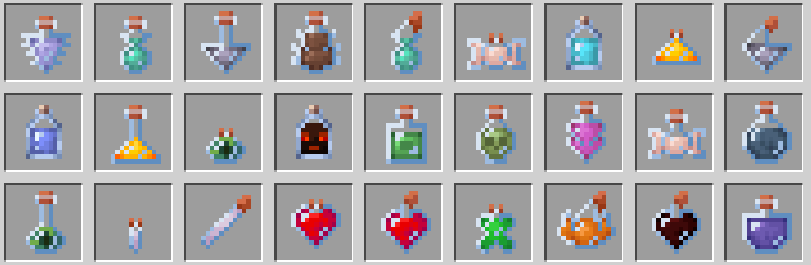

# Almost Vanilla Potions

Example image of some of the textures:

## About 

This is a texture pack for the game Minetest. It is a port of the textures created for this Minecraft mod (https://modrinth.com/resourcepack/almost-vanilla-potions).

You may notice that this is release under a mod and not a texture pack. This is because the way Mineclonia handles potion 
textures. Therefore one needs some code to override the existing textures with new ones.

## Credits

All credits go to the orignal author of the mod "Delled" on Modrinth.
One can find a link here to the chap (https://modrinth.com/user/Delled).

I have only ported these textures to Mintest as they were released under the MIT license.

## License

This is under the MIT license. See the LICENSE file included in the repo for more information.